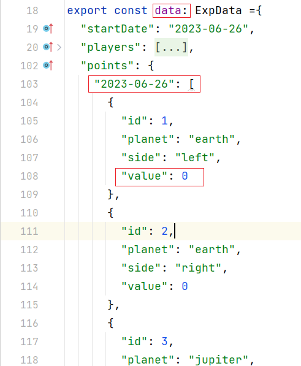
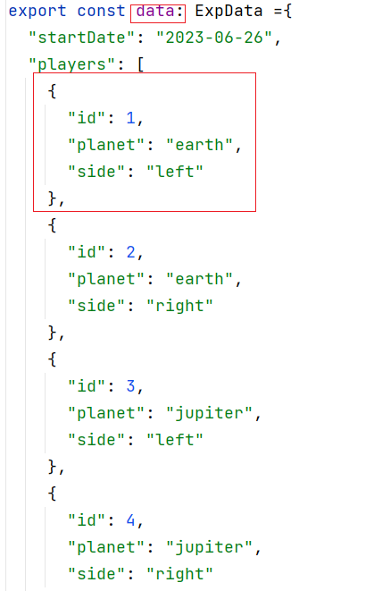

# How to run exp data

## quick start

Below is how to run the planet-walker app in few steps.

`Pre-requirement` Ensure the latest version of node is installed.

```shell
git clone https://github.com/yah-yuan/planet-walker.git
cd planet-walker
npm install
npm run start
```

Visit `http://localhost:4200/` to see the planet walker page.

## how to add daily data

Locate file `src/app/pixel-planet/utils/data.ts`.

To add data to a particular date, e.g. 2023-06-26, you can change the number showed in `data.points["2023-06-26"].value`.



To show a player's planet, first locate at `src/app/app.component.ts`.
Modify line 19 of value of `playerId` to the player id list in `data.ts` file.

For example, if you wish to show the participant whose planet is earth-left, you need to set `playerId` to 1.

## Remarks

Please do not push anything to main branch.
